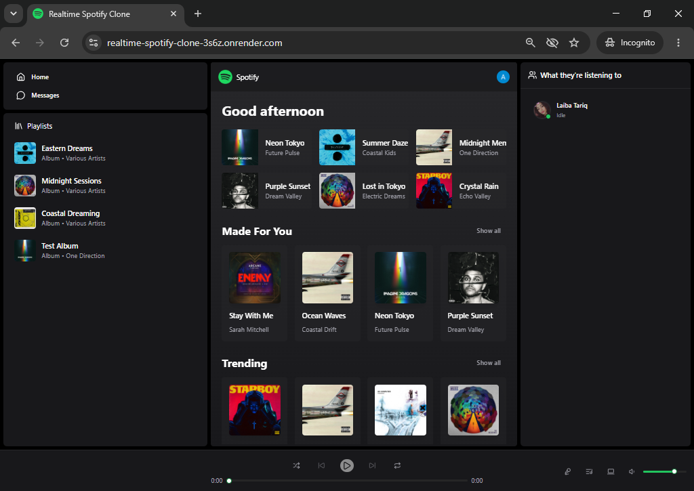
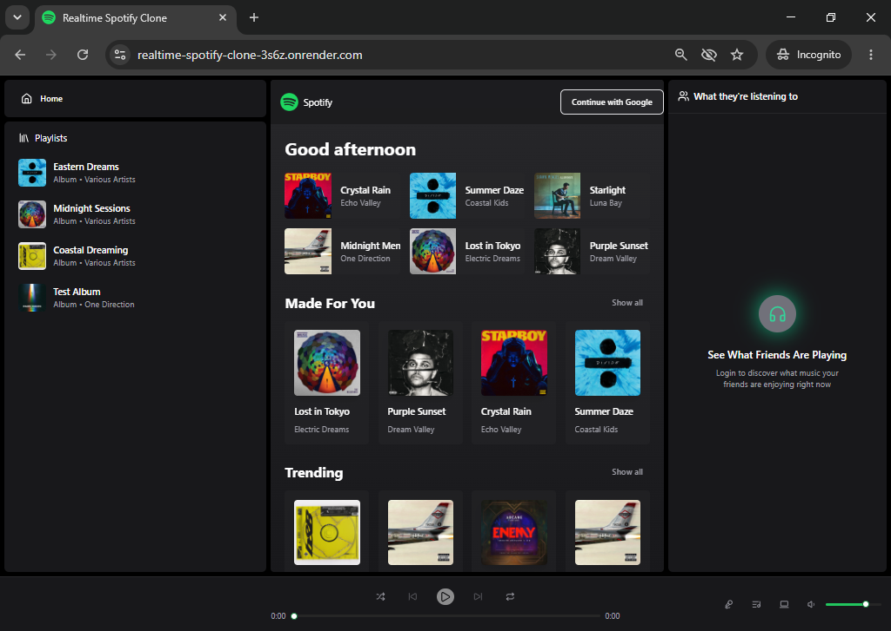
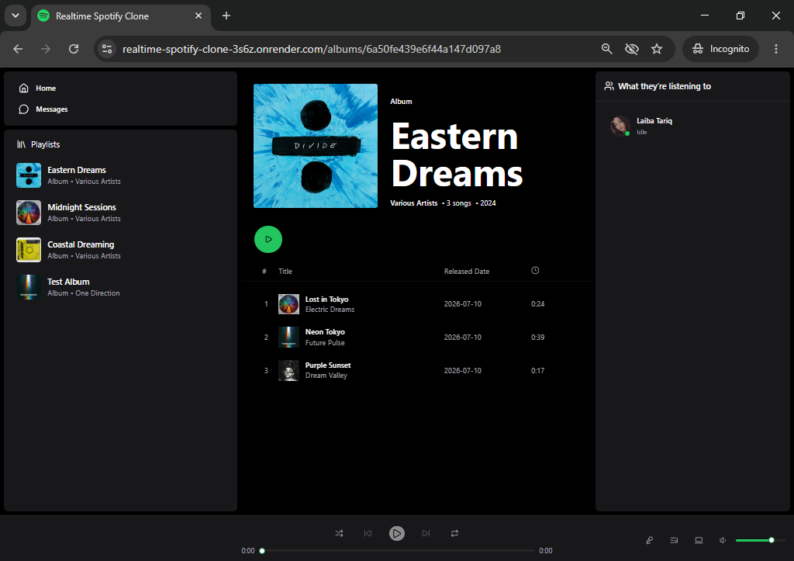
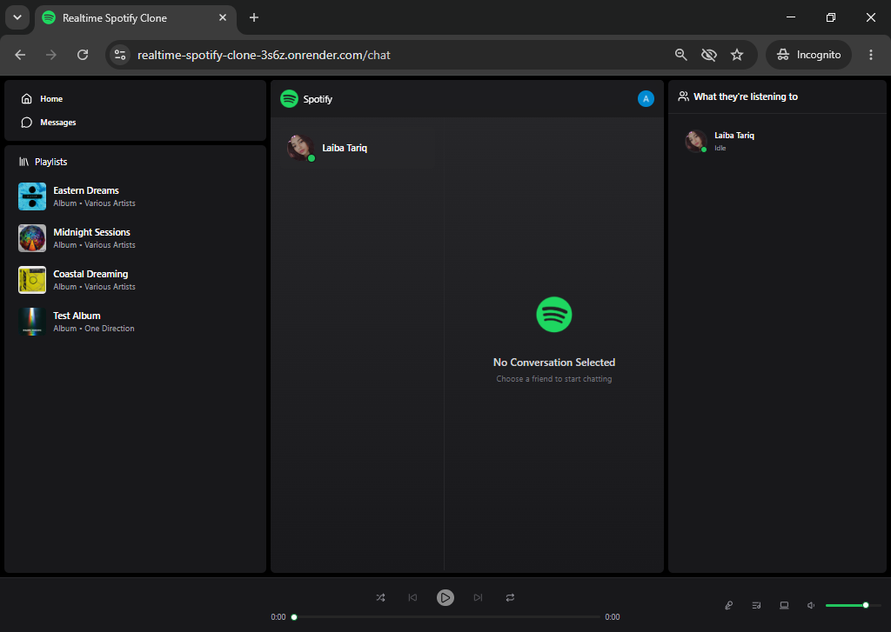
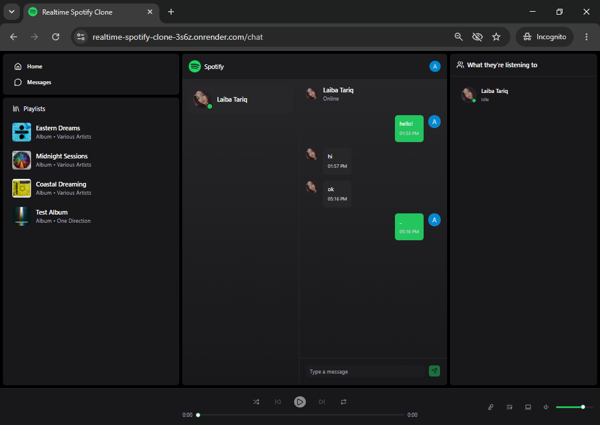
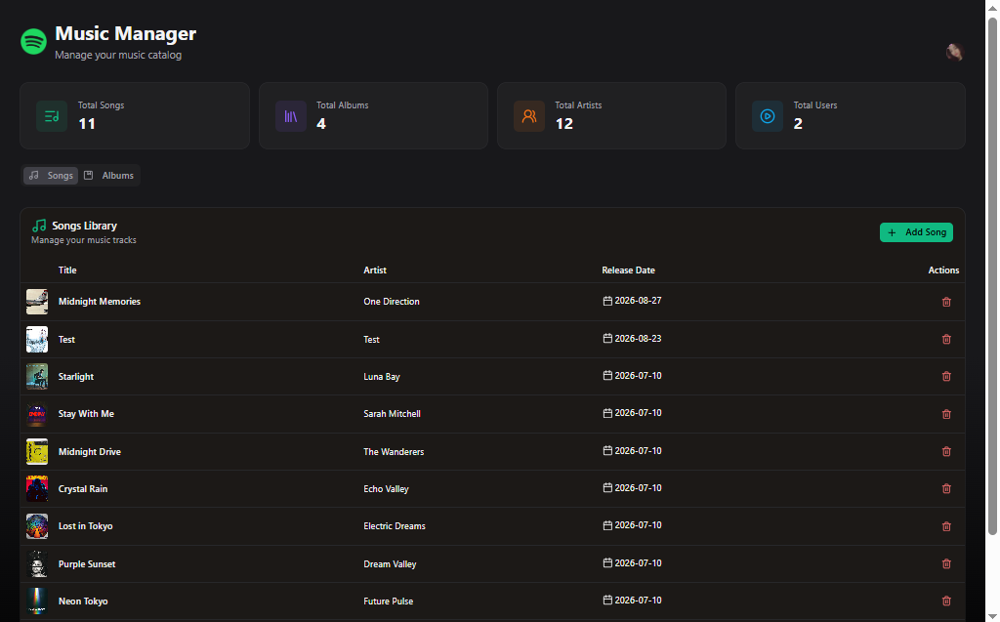
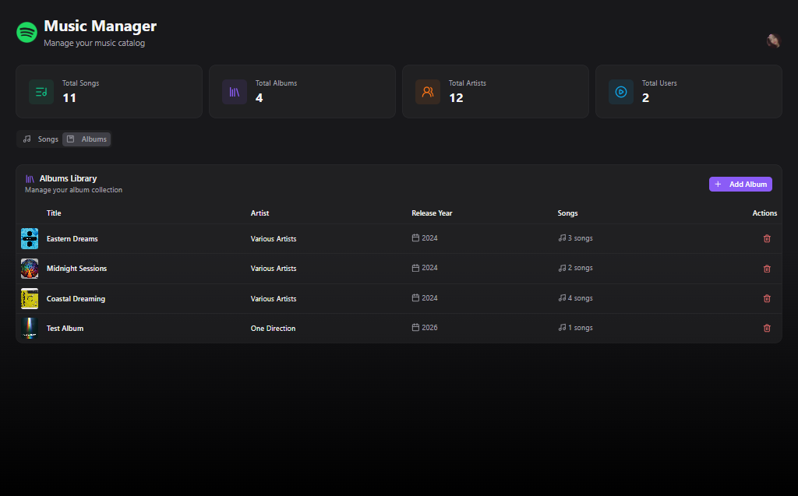
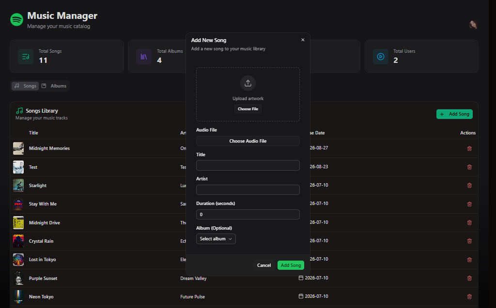
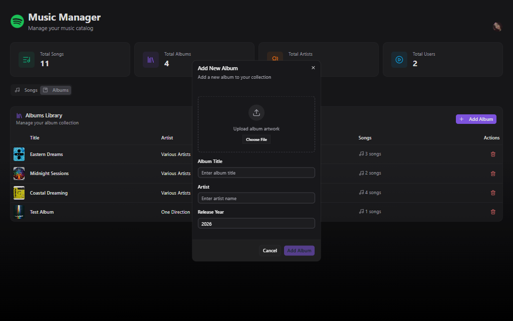

# Spotify Clone

A full-stack Spotify-inspired music streaming application built with the MERN stack. Users can browse music, play songs, view albums, chat with other users in real time, and see friends’ listening activity. Administrators can manage songs and albums through a protected dashboard.

## Live Preview

[View the live application](https://realtime-spotify-clone-3s6z.onrender.com/)

## Features

- Secure authentication with Clerk
- Browse featured, trending, and personalized music sections
- Play, pause, skip, and seek through songs
- Album pages with song lists
- Persistent audio player and playback queue
- Real-time one-to-one messaging with Socket.IO
- Online user status and live listening activity
- Protected admin dashboard
- Upload and delete songs and albums
- Cloudinary media storage for audio files and artwork
- Responsive Spotify-inspired interface

## Screenshots

### Home Page

<p align="center">
  
  
</p>

### Album and Chat

<p align="center">
  
  
</p>

<p align="center">
  
</p>

### Admin Dashboard

<p align="center">
  
  
</p>

<p align="center">
  
  
</p>

## Tech Stack

### Frontend

- React
- TypeScript
- Vite
- Tailwind CSS
- Zustand
- React Router
- Axios
- Socket.IO Client
- Clerk

### Backend

- Node.js
- Express
- MongoDB and Mongoose
- Socket.IO
- Clerk Express
- Cloudinary
- Express File Upload

## Project Structure

```text
mern-spotify-clone/
├── assets/
│   └── screenshots/            # README screenshots
├── backend/
│   ├── src/
│   │   ├── controllers/        # API request handlers
│   │   ├── lib/                # Database, Cloudinary, and Socket.IO setup
│   │   ├── middleware/         # Authentication and admin protection
│   │   ├── models/             # MongoDB models
│   │   ├── routes/             # Express API routes
│   │   ├── seeds/              # Initial song and album data
│   │   └── index.js            # Backend entry point
│   ├── .env                    # Environment variables — do not upload
│   └── package.json
├── frontend/
│   ├── public/                 # Static images and audio files
│   ├── src/
│   │   ├── components/         # Reusable UI components
│   │   ├── layout/             # Application layout and music player
│   │   ├── pages/              # Home, album, chat, and admin pages
│   │   ├── providers/          # Authentication provider
│   │   ├── stores/             # Zustand state management
│   │   ├── lib/                # Axios and utility functions
│   │   ├── types/              # TypeScript types
│   │   ├── App.tsx             # Routes and main application component
│   │   └── main.tsx            # Frontend entry point
│   ├── .env                    # Environment variables — do not upload
│   └── package.json
├── package.json                # Root scripts
└── README.md
```

## Getting Started

### Prerequisites

Make sure you have the following installed:

- Node.js
- npm
- MongoDB Atlas account or a local MongoDB instance
- Clerk account
- Cloudinary account

### 1. Clone the repository

```bash
git clone https://github.com/YOUR-USERNAME/mern-spotify-clone.git
cd mern-spotify-clone
```

### 2. Install dependencies

Install dependencies for both the frontend and backend:

```bash
npm install --prefix backend
npm install --prefix frontend
```

### 3. Configure environment variables

Create a `.env` file inside the `backend` folder:

```env
PORT=5000
NODE_ENV=development

MONGODB_URI=your_mongodb_connection_string

CLERK_SECRET_KEY=your_clerk_secret_key
ADMIN_EMAIL=your_admin_email@example.com

CLOUDINARY_CLOUD_NAME=your_cloudinary_cloud_name
CLOUDINARY_API_KEY=your_cloudinary_api_key
CLOUDINARY_API_SECRET=your_cloudinary_api_secret
```

Create a `.env` file inside the `frontend` folder:

```env
VITE_CLERK_PUBLISHABLE_KEY=your_clerk_publishable_key
```

### 4. Start the application

Start the backend server:

```bash
npm run dev --prefix backend
```

In a separate terminal, start the frontend:

```bash
npm run dev --prefix frontend
```

Open the app at the URL shown by Vite, typically:

```text
http://localhost:5173
```

## Available Scripts

### Root

```bash
npm run build
npm start
```

### Backend

```bash
npm run dev --prefix backend
npm start --prefix backend
npm run seed:songs --prefix backend
npm run seed:albums --prefix backend
```

### Frontend

```bash
npm run dev --prefix frontend
npm run build --prefix frontend
npm run lint --prefix frontend
```

## Production Build

Build the frontend for production:

```bash
npm run build
```

Then start the backend:

```bash
npm start
```

When `NODE_ENV=production`, the Express server serves the built frontend files.

## Environment Variables

| Variable | Description |
| --- | --- |
| `PORT` | Backend server port |
| `NODE_ENV` | Application environment |
| `MONGODB_URI` | MongoDB connection string |
| `CLERK_SECRET_KEY` | Clerk backend secret key |
| `VITE_CLERK_PUBLISHABLE_KEY` | Clerk frontend publishable key |
| `ADMIN_EMAIL` | Email address allowed to access the admin dashboard |
| `CLOUDINARY_CLOUD_NAME` | Cloudinary cloud name |
| `CLOUDINARY_API_KEY` | Cloudinary API key |
| `CLOUDINARY_API_SECRET` | Cloudinary API secret |

## License

This project is for educational purposes. It is not affiliated with or endorsed by Spotify.
